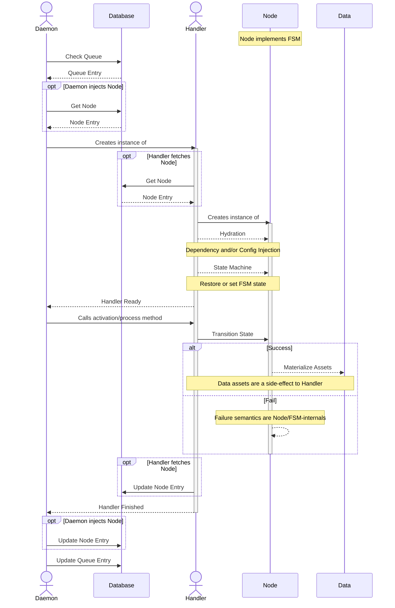

# Daemon Loop Iteration Sequence Diagram

```mermaid
sequenceDiagram
    actor Daemon
    participant Database
    actor Handler
    participant Node
    Note over Node: Node implements FSM
    participant Data

    Daemon ->> Database: Check Queue
    Database -->> Daemon: Queue Entry

    opt Daemon injects Node
    Daemon ->> Database: Get Node
    Database -->> Daemon: Node Entry
    end
    Daemon ->> Handler: Creates instance of
    activate Handler

    opt Handler fetches Node
    Handler ->> Database: Get Node
    Database -->> Handler: Node Entry
    end

    Handler ->> Node: Creates instance of
    activate Node
    Handler -->> Node: Hydration
    Note over Handler, Node: Dependency and/or Config Injection
    Handler -->> Node: State Machine
    Note over Handler, Node: Restore or set FSM state
    Handler -->> Daemon: Handler Ready
    Daemon ->> Handler: Calls activation/process method
    Handler ->> Node: Transition State
    alt Success
    Node -->> Data: Materialize Assets
    Note over Handler, Data: Data assets are a side-effect to Handler
    else Fail
    Note over Node: Failure semantics are Node/FSM-internals
    Node -->> Node:
    end
    deactivate Node
    opt Handler fetches Node
    Handler ->> Database: Update Node Entry
    end
    Handler -->> Daemon: Handler Finished
    deactivate Handler
    opt Daemon injects Node
    Daemon ->> Database: Update Node Entry
    end
    Daemon ->> Database: Update Queue Entry
```
