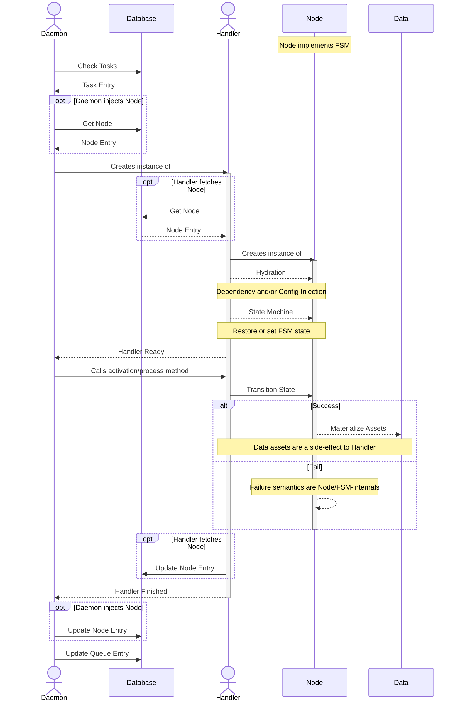

# Daemon Loop Iteration Sequence Diagram

The Daemon loop automates the evolution of Campaigns and their graphs.
Every Campaign is a graph of 2 or more Nodes, and each Node implements a Finite State Machine for which each state transition is associated with a business logic task and a check mechanism.
While Campaigns are not themselves state machines, they do have an associated status; `paused` for Campaigns that are not currently active, `running` for Campaigns that the Daemon should actively manage, and `accepted` for Campaigns that are complete with a positive outcome.

## Definitions
- `daemon`. One or more application service pods running an event loop dedicated to autonomous operations, including Campaign evolution, notification handling, and scheduled events.
- `database`. A PostgreSQL database supporting both the `daemon` and `api` service application pods for CRUD operations. Client utilities, such as web or cli tools, use the public API and not direct database access.
- `campaign`. A namespace containing a graph (nodes and edges), configuration manifests, and other assets specific to a campaign.
- `node`. A node in a campaign graph responsible for affecting a piece of business logic associated with the campaign. This is usually a Butler or BPS operation to manage data collections or Science Pipeline tasks/steps/stages.

##

