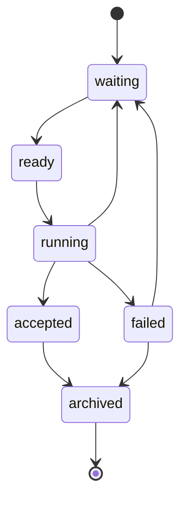
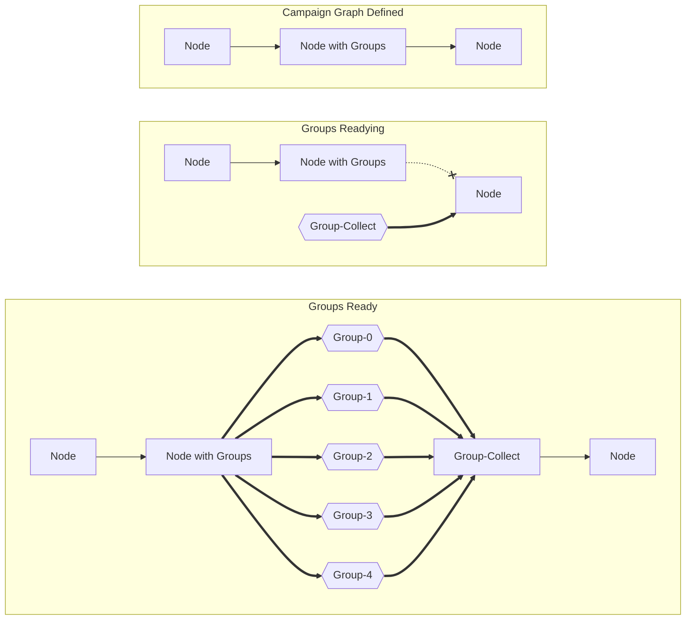
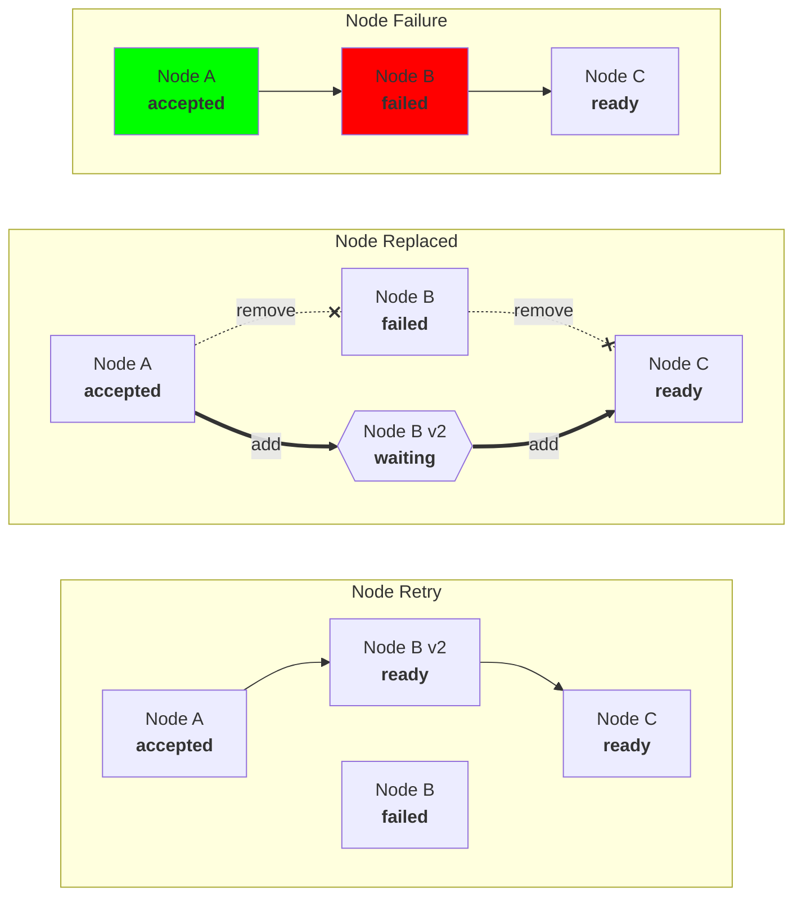

# Campaign State Machine

```mermaid
stateDiagram-v2
    [*] --> waiting
    waiting --> ready
    ready --> running
    running --> accepted
    running --> failed
    running --> waiting
    accepted --> archived
    failed --> archived
    failed --> waiting
    archived --> [*]
```

# Node-to-Groups

```mermaid
flowchart LR
    A[Node]
    B[Node with Groups]
    C[Node]

    D[Node]
    E[Node with Groups]
    F[Node]
    G{{Group-Collect}}

    L[Node]
    M[Node with Groups]
    N[Node]
    O[Group-Collect]

  subgraph Groups Ready
    direction LR
    L --> M
    O --> N
    M ==> P{{Group-0}} ==> O
    M ==> Q{{Group-1}} ==> O
    M ==> R{{Group-2}} ==> O
    M ==> S{{Group-3}} ==> O
    M ==> T{{Group-4}} ==> O
  end

  subgraph "Groups Readying"
    direction LR
    D --> E
    E -.-x F
    G ==> F
  end

  subgraph Campaign Graph Defined
    direction LR
    A --> B
    B --> C
  end
```

# Retry Strategy: Replacement

```mermaid
flowchart LR
  A["`Node A
  **accepted**`"]
  B["`Node B
  **failed**`"]
  C["`Node C
  **ready**`"]
  style A fill:#0f0
  style B fill:#f00

  D["`Node A
  **accepted**`"]
  E["`Node B
  **failed**`"]
  F["`Node C
  **ready**`"]
  G{{"`Node B v2
  **waiting**`"}}

  L["`Node A
  **accepted**`"]
  M["`Node B v2
  **ready**`"]
  N["`Node C
  **ready**`"]
  O["`Node B
  **failed**`"]

  subgraph Node Retry
    direction LR
    L --> M
    M --> N
    L ~~~ O ~~~ N
  end

  subgraph "Node Replaced"
    direction LR
    D -.-x|remove| E
    E -.-x|remove| F
    D ==>|add| G
    G ==>|add| F
  end

  subgraph "Node Failure"
    direction LR
    A --> B
    B --> C

  end
```

# Retry Strategy: Rollback
