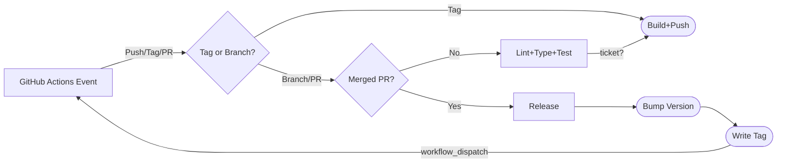

# CM-Service Github Workflows

The GitHub Actions Workflows in this repository enable a CI pattern for managing
service releases.

1. Any push to an active branch should trigger linting, typing, and testing jobs.
1. Any active "ticket" branch should trigger an OCI image build and push, so the work may be deployed to a dev or staging environment.
1. Any PR merged to `main` should trigger a "release", which should include bumping the project version and writing a Git tag.
1. Any new tags pushed to the repo should trigger an OCI image build and push, so the work may be deployed to a production environment.

## Flowchart

## Notes

Github Events are not generated by actions initiated using a `GITHUB_TOKEN`, e.g., a workflow that pushes to the repo does not itself cause a `push` event.
For this reason, the `build_and_push` workflow is explicitly triggered by the `release` workflow using a `workflow_dispatch` action.
